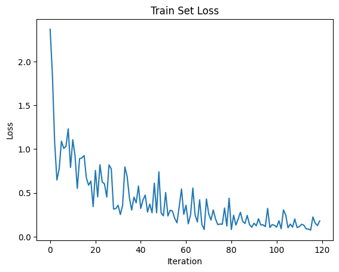
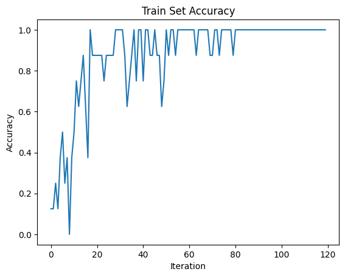
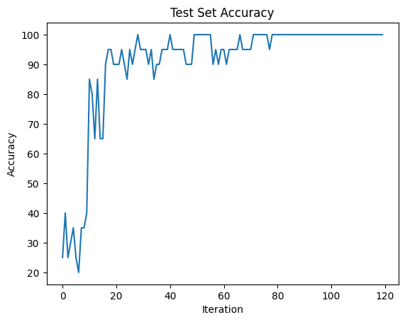

===================================================
Accelerating snnTorch on IPUs
===================================================

Tutorial written by George Austin

The snnTorch tutorial series is based on the following paper. If you find these resources or code useful in your work, please consider citing the following source:

    `Jason K. Eshraghian, Max Ward, Emre Neftci, Xinxin Wang, Gregor Lenz, Girish
    Dwivedi, Mohammed Bennamoun, Doo Seok Jeong, and Wei D. Lu. “Training
    Spiking Neural Networks Using Lessons From Deep Learning”. Proceedings of the IEEE, 111(9) September 2023. <https://ieeexplore.ieee.org/abstract/document/10242251>`_

.. note::
  This tutorial is a static non-editable version. An editable script is available via the following link:
    * `Python Script (download via GitHub) <https://github.com/jeshraghian/snntorch/tree/master/examples/tutorial_ipu_1.py>`_

Introduction
-------------

In this tutorial, you will:

* Train a spiking convolutional SNN
* Construct a dataloader using `Tonic <https://tonic.readthedocs.io/en/latest/#>`_
* Train a model on the `DVS Gesture Dataset <https://research.ibm.com/interactive/dvsgesture/>`_

If running in Google Colab:

* You may connect to GPU by checking ``Runtime`` > ``Change runtime type`` > ``Hardware accelerator: GPU``
* Next, install the latest PyPi distribution of snnTorch by clicking into the following cell and pressing ``Shift+Enter``.

::

    !pip install snntorch --quiet
    !pip install tonic --quiet

::

    # imports
    import tonic
    import matplotlib.pyplot as plt
    import tonic.transforms as transforms

    import torch
    import torchvision

    import snntorch as snn
    from snntorch import surrogate
    from snntorch import functional as SF
    from snntorch import utils
    import torch.nn as nn

    device = torch.device("cuda") if torch.cuda.is_available() else torch.device("mps") if torch.backends.mps.is_available() else torch.device("cpu")

1. The Dataset - POKERDVS
-------------------------

The dataset used in this tutorial is POKERDVS by T. Serrano-Gotarredona and B. Linares-Barranco.

It is comprised of 4 classes, each being a suite of a playing card deck. (clubs, spades, hearts, and diamonds)

The data consists of 131 poker pip symbols, and was collected by flipping poker cards in front of a DVS128 camera.

1.1 Loading the Dataset and Transforming it with Tonic
~~~~~~~~~~~~~~~~~~~~~~~~~~~~~~~~~~~~~~~~~~~~~~~~~~~~~~

The dataset presents data in a raw event format, so it must be shaped into a suitable format that can be fed into a model.

The following code bins the raw DVS event data into 2000ms time windows, allowing the resulting tensors to be preprocessed before being put into the DataLoader.

::

    sensor_size = tonic.datasets.POKERDVS.sensor_size
    # converting 2000 ms blocks of data into frames
    frame_transform = transforms.ToFrame(sensor_size=sensor_size, time_window=2000)

    poker_train = tonic.datasets.POKERDVS(save_to = './data', train = True, transform = frame_transform)
    poker_test = tonic.datasets.POKERDVS(save_to = './data', train = False, transform = frame_transform)

::

    Downloading https://nextcloud.lenzgregor.com/s/ZeCPYBS8kx4Wyjd/download/pips_train.tar.gz to ./data/POKERDVS/pips_train.tar.gz

::

    Extracting ./data/POKERDVS/pips_train.tar.gz to ./data/POKERDVS
    Downloading https://nextcloud.lenzgregor.com/s/2iRfwg3y9eAMpGL/download/pips_test.tar.gz to ./data/POKERDVS/pips_test.tar.gz

::

    Extracting ./data/POKERDVS/pips_test.tar.gz to ./data/POKERDVS

1.2 Visualizing the Data
~~~~~~~~~~~~~~~~~~~~~~~~

We can use pyplot to visualize each of the frames being passed into the dataloader.

As seen below, outlines of poker symbols are visible in each frame.

::

    fig, ax = plt.subplots(1, 6)
    data, targets = poker_train[0]
    ax[0].axis('off')
    ax[1].axis('off')
    ax[2].axis('off')
    ax[3].axis('off')
    ax[4].axis('off')
    ax[5].axis('off')
    ax[0].imshow(data[0][0])
    ax[1].imshow(data[0][1])
    ax[2].imshow(data[3][0])
    ax[3].imshow(data[3][1])
    ax[4].imshow(data[5][0])
    ax[5].imshow(data[5][1])

1.3 Caching and Loading the Dataset
~~~~~~~~~~~~~~~~~~~~~~~~~~~~~~~~~~~

A dataloader can be used to prepare our data for training by separating it into batches and shuffling it. We can also use caching to speed up the dataloading process by reading data from cache rather than the disk.

::

    from tonic import DiskCachedDataset

    cached_trainset = DiskCachedDataset(poker_train, cache_path='./cache/dvspoker/train')
    cached_testset = DiskCachedDataset(poker_test, cache_path='./cache/dvspoker/test')

::

    #Set a mini-batch size of 8, for a total of 6 training batches
    batch_size = 8
    trainloader = DataLoader(cached_trainset, batch_size=batch_size, collate_fn=tonic.collation.PadTensors(batch_first=False), shuffle=True)
    testloader = DataLoader(cached_testset, batch_size=batch_size, collate_fn=tonic.collation.PadTensors(batch_first=False))

::

    print(len(trainloader))

::

    6

2. The Model
------------

2.1 Defining the Network
~~~~~~~~~~~~~~~~~~~~~~~~

The model used is a sequential network comprised of two sets of convolution layers with 5x5 filters, followed by a final linear and leaky output layer that convert the 800 tensor into 4 output classes.

The forward function gets the spikes from one batch of data and returns them as a tensor.

::

    #parameters
    num_classes = 4
    spike_grad = surrogate.atan() # arctan surrogate gradient function
    beta = 0.5

    net = nn.Sequential(nn.Conv2d(2, 12, 5), # first conv layer
                              snn.Leaky(beta=beta, spike_grad=spike_grad, init_hidden=True),
                              nn.MaxPool2d(2),
                              nn.Conv2d(12, 32, 5), # second conv layer
                              snn.Leaky(beta=beta, spike_grad=spike_grad, init_hidden=True),
                              nn.MaxPool2d(2),
                              nn.Flatten(),
                              nn.Linear(32*5*5, num_classes), #flattened linear layer
                              snn.Leaky(beta=beta, spike_grad=spike_grad, init_hidden=True, output=True)
                              ).to(device)

    def forward(net, data):  # define forward function
        spk_rec = []
        utils.reset(net)  # resets hidden states for all LIF neurons in net
        for step in range(data.size(0)):  # data.size(0) = number of time steps
            spk_out, mem_out = net(data[step])
            spk_rec.append(spk_out)
        return torch.stack(spk_rec)

::

    optimizer = torch.optim.Adam(net.parameters(), lr=0.003, betas=(0.9, 0.999)) # learning rate = 0.003
    loss_fn = SF.mse_count_loss(correct_rate=0.8, incorrect_rate=0.2) # MSE loss function

2.2 Training
~~~~~~~~~~~~

We will be training our network for 20 epochs, and 6 iterations, since there are 8 batches and 48 total training examples.

::

    num_epochs = 20
    num_iters = 6

    loss_hist = []
    acc_hist = []
    test_acc_hist = []

    # training loop
    for epoch in range(num_epochs):
        for i, (data, targets) in enumerate(iter(trainloader)):
            data = data.to(device)
            targets = targets.to(device)

            net.train()
            spk_rec = forward(net, data)
            loss_val = loss_fn(spk_rec, targets)

            # Gradient calculation + weight update
            optimizer.zero_grad()
            loss_val.backward()
            optimizer.step()

            # Store loss history for future plotting
            loss_hist.append(loss_val.item())

            print(f"Epoch {epoch}, Iteration {i} \nTrain Loss: {loss_val.item():.2f}")

            acc = SF.accuracy_rate(spk_rec, targets)
            acc_hist.append(acc)
            print(f"Accuracy: {acc * 100:.2f}%\n")

            correct = 0
            total = 0
            for i, (test_data, test_targets) in enumerate(iter(testloader)):
                test_data = test_data.to(device)
                test_targets = test_targets.to(device)
                spk_rec = forward(net, test_data)
                correct += SF.accuracy_rate(spk_rec, test_targets) * spk_rec.size(1)
                total += spk_rec.size(1)

            test_acc = (correct/total) * 100
            test_acc_hist.append(test_acc)
            print(f"========== Test Set Accuracy: {test_acc:.2f}% ==========\n")
            # This will end training after 6 iterations by default
            if i == num_iters:
                break

::

    Epoch 0, Iteration 0 
    Train Loss: 2.37
    Accuracy: 12.50%

    ========== Test Set Accuracy: 25.00% ==========

    Epoch 0, Iteration 1 
    Train Loss: 1.86
    Accuracy: 12.50%

    ========== Test Set Accuracy: 40.00% ==========

    Epoch 0, Iteration 2 
    Train Loss: 1.08
    Accuracy: 25.00%

    ========== Test Set Accuracy: 25.00% ==========

    Epoch 0, Iteration 3 
    Train Loss: 0.65
    Accuracy: 12.50%

    ========== Test Set Accuracy: 30.00% ==========

    Epoch 0, Iteration 4 
    Train Loss: 0.78
    Accuracy: 37.50%

    ========== Test Set Accuracy: 35.00% ==========

    Epoch 0, Iteration 5 
    Train Loss: 1.09
    Accuracy: 50.00%

    ========== Test Set Accuracy: 25.00% ==========

    Epoch 1, Iteration 0 
    Train Loss: 1.01
    Accuracy: 25.00%

    ========== Test Set Accuracy: 20.00% ==========

    Epoch 1, Iteration 1 
    Train Loss: 1.03
    Accuracy: 37.50%

    ========== Test Set Accuracy: 35.00% ==========

    Epoch 1, Iteration 2 
    Train Loss: 1.23
    Accuracy: 0.00%

    ========== Test Set Accuracy: 35.00% ==========

    Epoch 1, Iteration 3 
    Train Loss: 0.79
    Accuracy: 37.50%

    ========== Test Set Accuracy: 40.00% ==========

    Epoch 1, Iteration 4 
    Train Loss: 1.11
    Accuracy: 50.00%

    ========== Test Set Accuracy: 85.00% ==========

    Epoch 1, Iteration 5 
    Train Loss: 0.93
    Accuracy: 75.00%

    ========== Test Set Accuracy: 80.00% ==========

    Epoch 2, Iteration 0 
    Train Loss: 0.55
    Accuracy: 62.50%

    ========== Test Set Accuracy: 65.00% ==========

    Epoch 2, Iteration 1 
    Train Loss: 0.89
    Accuracy: 75.00%

    ========== Test Set Accuracy: 85.00% ==========

    Epoch 2, Iteration 2 
    Train Loss: 0.90
    Accuracy: 87.50%

    ========== Test Set Accuracy: 65.00% ==========

    Epoch 2, Iteration 3 
    Train Loss: 0.93
    Accuracy: 62.50%

    ========== Test Set Accuracy: 65.00% ==========

    Epoch 2, Iteration 4 
    Train Loss: 0.67
    Accuracy: 37.50%

    ========== Test Set Accuracy: 90.00% ==========

    Epoch 2, Iteration 5 
    Train Loss: 0.59
    Accuracy: 100.00%

    ========== Test Set Accuracy: 95.00% ==========

    Epoch 3, Iteration 0 
    Train Loss: 0.64
    Accuracy: 87.50%

    ========== Test Set Accuracy: 95.00% ==========

    Epoch 3, Iteration 1 
    Train Loss: 0.34
    Accuracy: 87.50%

    ========== Test Set Accuracy: 90.00% ==========

    Epoch 3, Iteration 2 
    Train Loss: 0.76
    Accuracy: 87.50%

    ========== Test Set Accuracy: 90.00% ==========

    Epoch 3, Iteration 3 
    Train Loss: 0.45
    Accuracy: 87.50%

    ========== Test Set Accuracy: 90.00% ==========

    Epoch 3, Iteration 4 
    Train Loss: 0.82
    Accuracy: 87.50%

    ========== Test Set Accuracy: 95.00% ==========

    Epoch 3, Iteration 5 
    Train Loss: 0.62
    Accuracy: 75.00%

    ========== Test Set Accuracy: 90.00% ==========

    Epoch 4, Iteration 0 
    Train Loss: 0.60
    Accuracy: 87.50%

    ========== Test Set Accuracy: 85.00% ==========

    Epoch 4, Iteration 1 
    Train Loss: 0.45
    Accuracy: 87.50%

    ========== Test Set Accuracy: 95.00% ==========

    Epoch 4, Iteration 2 
    Train Loss: 0.82
    Accuracy: 87.50%

    ========== Test Set Accuracy: 90.00% ==========

    Epoch 4, Iteration 3 
    Train Loss: 0.77
    Accuracy: 87.50%

    ========== Test Set Accuracy: 95.00% ==========

    Epoch 4, Iteration 4 
    Train Loss: 0.32
    Accuracy: 100.00%

    ========== Test Set Accuracy: 100.00% ==========

    Epoch 4, Iteration 5 
    Train Loss: 0.32
    Accuracy: 100.00%

    ========== Test Set Accuracy: 95.00% ==========

    Epoch 5, Iteration 0 
    Train Loss: 0.36
    Accuracy: 100.00%

    ========== Test Set Accuracy: 95.00% ==========

    Epoch 5, Iteration 1 
    Train Loss: 0.25
    Accuracy: 100.00%

    ========== Test Set Accuracy: 95.00% ==========

    Epoch 5, Iteration 2 
    Train Loss: 0.36
    Accuracy: 87.50%

    ========== Test Set Accuracy: 90.00% ==========

    Epoch 5, Iteration 3 
    Train Loss: 0.80
    Accuracy: 62.50%

    ========== Test Set Accuracy: 95.00% ==========

    Epoch 5, Iteration 4 
    Train Loss: 0.69
    Accuracy: 75.00%

    ========== Test Set Accuracy: 85.00% ==========

    Epoch 5, Iteration 5 
    Train Loss: 0.44
    Accuracy: 87.50%

    ========== Test Set Accuracy: 90.00% ==========

    Epoch 6, Iteration 0 
    Train Loss: 0.30
    Accuracy: 100.00%

    ========== Test Set Accuracy: 90.00% ==========

    Epoch 6, Iteration 1 
    Train Loss: 0.45
    Accuracy: 75.00%

    ========== Test Set Accuracy: 95.00% ==========

    Epoch 6, Iteration 2 
    Train Loss: 0.39
    Accuracy: 100.00%

    ========== Test Set Accuracy: 95.00% ==========

    Epoch 6, Iteration 3 
    Train Loss: 0.58
    Accuracy: 100.00%

    ========== Test Set Accuracy: 95.00% ==========

    Epoch 6, Iteration 4 
    Train Loss: 0.32
    Accuracy: 75.00%

    ========== Test Set Accuracy: 100.00% ==========

    Epoch 6, Iteration 5 
    Train Loss: 0.42
    Accuracy: 100.00%

    ========== Test Set Accuracy: 95.00% ==========

    Epoch 7, Iteration 0 
    Train Loss: 0.48
    Accuracy: 100.00%

    ========== Test Set Accuracy: 95.00% ==========

    Epoch 7, Iteration 1 
    Train Loss: 0.28
    Accuracy: 87.50%

    ========== Test Set Accuracy: 95.00% ==========

    Epoch 7, Iteration 2 
    Train Loss: 0.37
    Accuracy: 87.50%

    ========== Test Set Accuracy: 95.00% ==========

    Epoch 7, Iteration 3 
    Train Loss: 0.27
    Accuracy: 100.00%

    ========== Test Set Accuracy: 95.00% ==========

    Epoch 7, Iteration 4 
    Train Loss: 0.61
    Accuracy: 87.50%

    ========== Test Set Accuracy: 90.00% ==========

    Epoch 7, Iteration 5 
    Train Loss: 0.27
    Accuracy: 87.50%

    ========== Test Set Accuracy: 90.00% ==========

    Epoch 8, Iteration 0 
    Train Loss: 0.74
    Accuracy: 62.50%

    ========== Test Set Accuracy: 90.00% ==========

    Epoch 8, Iteration 1 
    Train Loss: 0.27
    Accuracy: 75.00%

    ========== Test Set Accuracy: 100.00% ==========

    Epoch 8, Iteration 2 
    Train Loss: 0.24
    Accuracy: 100.00%

    ========== Test Set Accuracy: 100.00% ==========

    Epoch 8, Iteration 3 
    Train Loss: 0.50
    Accuracy: 87.50%

    ========== Test Set Accuracy: 100.00% ==========

    Epoch 8, Iteration 4 
    Train Loss: 0.24
    Accuracy: 100.00%

    ========== Test Set Accuracy: 100.00% ==========

    Epoch 8, Iteration 5 
    Train Loss: 0.30
    Accuracy: 100.00%

    ========== Test Set Accuracy: 100.00% ==========

    Epoch 9, Iteration 0 
    Train Loss: 0.29
    Accuracy: 87.50%

    ========== Test Set Accuracy: 100.00% ==========

    Epoch 9, Iteration 1 
    Train Loss: 0.21
    Accuracy: 100.00%

    ========== Test Set Accuracy: 100.00% ==========

    Epoch 9, Iteration 2 
    Train Loss: 0.16
    Accuracy: 100.00%

    ========== Test Set Accuracy: 90.00% ==========

    Epoch 9, Iteration 3 
    Train Loss: 0.35
    Accuracy: 100.00%

    ========== Test Set Accuracy: 95.00% ==========

    Epoch 9, Iteration 4 
    Train Loss: 0.54
    Accuracy: 100.00%

    ========== Test Set Accuracy: 90.00% ==========

    Epoch 9, Iteration 5 
    Train Loss: 0.26
    Accuracy: 100.00%

    ========== Test Set Accuracy: 95.00% ==========

    Epoch 10, Iteration 0 
    Train Loss: 0.36
    Accuracy: 100.00%

    ========== Test Set Accuracy: 95.00% ==========

    Epoch 10, Iteration 1 
    Train Loss: 0.15
    Accuracy: 100.00%

    ========== Test Set Accuracy: 90.00% ==========

    Epoch 10, Iteration 2 
    Train Loss: 0.25
    Accuracy: 100.00%

    ========== Test Set Accuracy: 95.00% ==========

    Epoch 10, Iteration 3 
    Train Loss: 0.56
    Accuracy: 87.50%

    ========== Test Set Accuracy: 95.00% ==========

    Epoch 10, Iteration 4 
    Train Loss: 0.25
    Accuracy: 100.00%

    ========== Test Set Accuracy: 95.00% ==========

    Epoch 10, Iteration 5 
    Train Loss: 0.17
    Accuracy: 100.00%

    ========== Test Set Accuracy: 95.00% ==========

    Epoch 11, Iteration 0 
    Train Loss: 0.42
    Accuracy: 100.00%

    ========== Test Set Accuracy: 100.00% ==========

    Epoch 11, Iteration 1 
    Train Loss: 0.14
    Accuracy: 100.00%

    ========== Test Set Accuracy: 95.00% ==========

    Epoch 11, Iteration 2 
    Train Loss: 0.08
    Accuracy: 100.00%

    ========== Test Set Accuracy: 95.00% ==========

    Epoch 11, Iteration 3 
    Train Loss: 0.43
    Accuracy: 87.50%

    ========== Test Set Accuracy: 95.00% ==========

    Epoch 11, Iteration 4 
    Train Loss: 0.26
    Accuracy: 87.50%

    ========== Test Set Accuracy: 95.00% ==========

    Epoch 11, Iteration 5 
    Train Loss: 0.19
    Accuracy: 100.00%

    ========== Test Set Accuracy: 100.00% ==========

    Epoch 12, Iteration 0 
    Train Loss: 0.31
    Accuracy: 100.00%

    ========== Test Set Accuracy: 100.00% ==========

    Epoch 12, Iteration 1 
    Train Loss: 0.20
    Accuracy: 87.50%

    ========== Test Set Accuracy: 100.00% ==========

    Epoch 12, Iteration 2 
    Train Loss: 0.14
    Accuracy: 100.00%

    ========== Test Set Accuracy: 100.00% ==========

    Epoch 12, Iteration 3 
    Train Loss: 0.14
    Accuracy: 100.00%

    ========== Test Set Accuracy: 100.00% ==========

    Epoch 12, Iteration 4 
    Train Loss: 0.14
    Accuracy: 100.00%

    ========== Test Set Accuracy: 100.00% ==========

    Epoch 12, Iteration 5 
    Train Loss: 0.33
    Accuracy: 100.00%

    ========== Test Set Accuracy: 95.00% ==========

    Epoch 13, Iteration 0 
    Train Loss: 0.12
    Accuracy: 100.00%

    ========== Test Set Accuracy: 100.00% ==========

    Epoch 13, Iteration 1 
    Train Loss: 0.44
    Accuracy: 87.50%

    ========== Test Set Accuracy: 100.00% ==========

    Epoch 13, Iteration 2 
    Train Loss: 0.08
    Accuracy: 100.00%

    ========== Test Set Accuracy: 100.00% ==========

    Epoch 13, Iteration 3 
    Train Loss: 0.25
    Accuracy: 100.00%

    ========== Test Set Accuracy: 100.00% ==========

    Epoch 13, Iteration 4 
    Train Loss: 0.13
    Accuracy: 100.00%

    ========== Test Set Accuracy: 100.00% ==========

    Epoch 13, Iteration 5 
    Train Loss: 0.20
    Accuracy: 100.00%

    ========== Test Set Accuracy: 100.00% ==========

    Epoch 14, Iteration 0 
    Train Loss: 0.28
    Accuracy: 100.00%

    ========== Test Set Accuracy: 100.00% ==========

    Epoch 14, Iteration 1 
    Train Loss: 0.18
    Accuracy: 100.00%

    ========== Test Set Accuracy: 100.00% ==========

    Epoch 14, Iteration 2 
    Train Loss: 0.15
    Accuracy: 100.00%

    ========== Test Set Accuracy: 100.00% ==========

    Epoch 14, Iteration 3 
    Train Loss: 0.24
    Accuracy: 100.00%

    ========== Test Set Accuracy: 100.00% ==========

    Epoch 14, Iteration 4 
    Train Loss: 0.14
    Accuracy: 100.00%

    ========== Test Set Accuracy: 100.00% ==========

    Epoch 14, Iteration 5 
    Train Loss: 0.11
    Accuracy: 100.00%

    ========== Test Set Accuracy: 100.00% ==========

    Epoch 15, Iteration 0 
    Train Loss: 0.15
    Accuracy: 100.00%

    ========== Test Set Accuracy: 100.00% ==========

    Epoch 15, Iteration 1 
    Train Loss: 0.12
    Accuracy: 100.00%

    ========== Test Set Accuracy: 100.00% ==========

    Epoch 15, Iteration 2 
    Train Loss: 0.21
    Accuracy: 100.00%

    ========== Test Set Accuracy: 100.00% ==========

    Epoch 15, Iteration 3 
    Train Loss: 0.13
    Accuracy: 100.00%

    ========== Test Set Accuracy: 100.00% ==========

    Epoch 15, Iteration 4 
    Train Loss: 0.14
    Accuracy: 100.00%

    ========== Test Set Accuracy: 100.00% ==========

    Epoch 15, Iteration 5 
    Train Loss: 0.12
    Accuracy: 100.00%

    ========== Test Set Accuracy: 100.00% ==========

    Epoch 16, Iteration 0 
    Train Loss: 0.32
    Accuracy: 100.00%

    ========== Test Set Accuracy: 100.00% ==========

    Epoch 16, Iteration 1 
    Train Loss: 0.11
    Accuracy: 100.00%

    ========== Test Set Accuracy: 100.00% ==========

    Epoch 16, Iteration 2 
    Train Loss: 0.14
    Accuracy: 100.00%

    ========== Test Set Accuracy: 100.00% ==========

    Epoch 16, Iteration 3 
    Train Loss: 0.13
    Accuracy: 100.00%

    ========== Test Set Accuracy: 100.00% ==========

    Epoch 16, Iteration 4 
    Train Loss: 0.11
    Accuracy: 100.00%

    ========== Test Set Accuracy: 100.00% ==========

    Epoch 16, Iteration 5 
    Train Loss: 0.18
    Accuracy: 100.00%

    ========== Test Set Accuracy: 100.00% ==========

    Epoch 17, Iteration 0 
    Train Loss: 0.09
    Accuracy: 100.00%

    ========== Test Set Accuracy: 100.00% ==========

    Epoch 17, Iteration 1 
    Train Loss: 0.31
    Accuracy: 100.00%

    ========== Test Set Accuracy: 100.00% ==========

    Epoch 17, Iteration 2 
    Train Loss: 0.25
    Accuracy: 100.00%

    ========== Test Set Accuracy: 100.00% ==========

    Epoch 17, Iteration 3 
    Train Loss: 0.10
    Accuracy: 100.00%

    ========== Test Set Accuracy: 100.00% ==========

    Epoch 17, Iteration 4 
    Train Loss: 0.14
    Accuracy: 100.00%

    ========== Test Set Accuracy: 100.00% ==========

    Epoch 17, Iteration 5 
    Train Loss: 0.11
    Accuracy: 100.00%

    ========== Test Set Accuracy: 100.00% ==========

    Epoch 18, Iteration 0 
    Train Loss: 0.20
    Accuracy: 100.00%

    ========== Test Set Accuracy: 100.00% ==========

    Epoch 18, Iteration 1 
    Train Loss: 0.11
    Accuracy: 100.00%

    ========== Test Set Accuracy: 100.00% ==========

    Epoch 18, Iteration 2 
    Train Loss: 0.11
    Accuracy: 100.00%

    ========== Test Set Accuracy: 100.00% ==========

    Epoch 18, Iteration 3 
    Train Loss: 0.14
    Accuracy: 100.00%

    ========== Test Set Accuracy: 100.00% ==========

    Epoch 18, Iteration 4 
    Train Loss: 0.13
    Accuracy: 100.00%

    ========== Test Set Accuracy: 100.00% ==========

    Epoch 18, Iteration 5 
    Train Loss: 0.09
    Accuracy: 100.00%

    ========== Test Set Accuracy: 100.00% ==========

    Epoch 19, Iteration 0 
    Train Loss: 0.09
    Accuracy: 100.00%

    ========== Test Set Accuracy: 100.00% ==========

    Epoch 19, Iteration 1 
    Train Loss: 0.08
    Accuracy: 100.00%

    ========== Test Set Accuracy: 100.00% ==========

    Epoch 19, Iteration 2 
    Train Loss: 0.23
    Accuracy: 100.00%

    ========== Test Set Accuracy: 100.00% ==========

    Epoch 19, Iteration 3 
    Train Loss: 0.16
    Accuracy: 100.00%

    ========== Test Set Accuracy: 100.00% ==========

    Epoch 19, Iteration 4 
    Train Loss: 0.13
    Accuracy: 100.00%

    ========== Test Set Accuracy: 100.00% ==========

    Epoch 19, Iteration 5 
    Train Loss: 0.18
    Accuracy: 100.00%

    ========== Test Set Accuracy: 100.00% ==========

3. Results
----------

::

    # Plot Loss
    fig = plt.figure(facecolor="w")
    plt.plot(loss_hist)
    plt.title("Train Set Loss")
    plt.xlabel("Iteration")
    plt.ylabel("Loss")
    plt.show()

::

    # Plot Train Accuracy
    fig = plt.figure(facecolor="w")
    plt.plot(acc_hist)
    plt.title("Train Set Accuracy")
    plt.xlabel("Iteration")
    plt.ylabel("Accuracy")
    plt.show()

::

    # Plot Test Accuracy
    fig = plt.figure(facecolor="w")
    plt.plot(test_acc_hist)
    plt.title("Test Set Accuracy")
    plt.xlabel("Iteration")
    plt.ylabel("Accuracy")
    plt.show()

